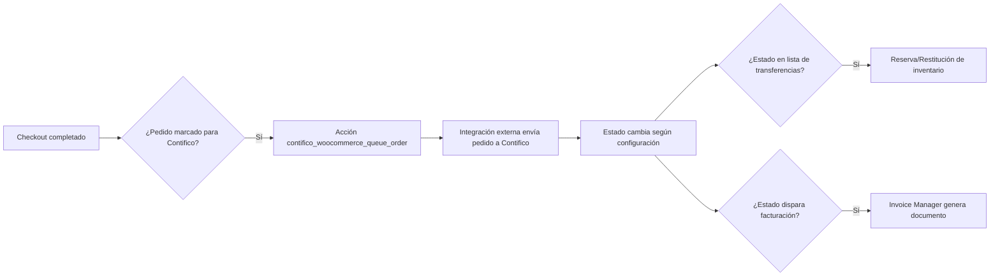
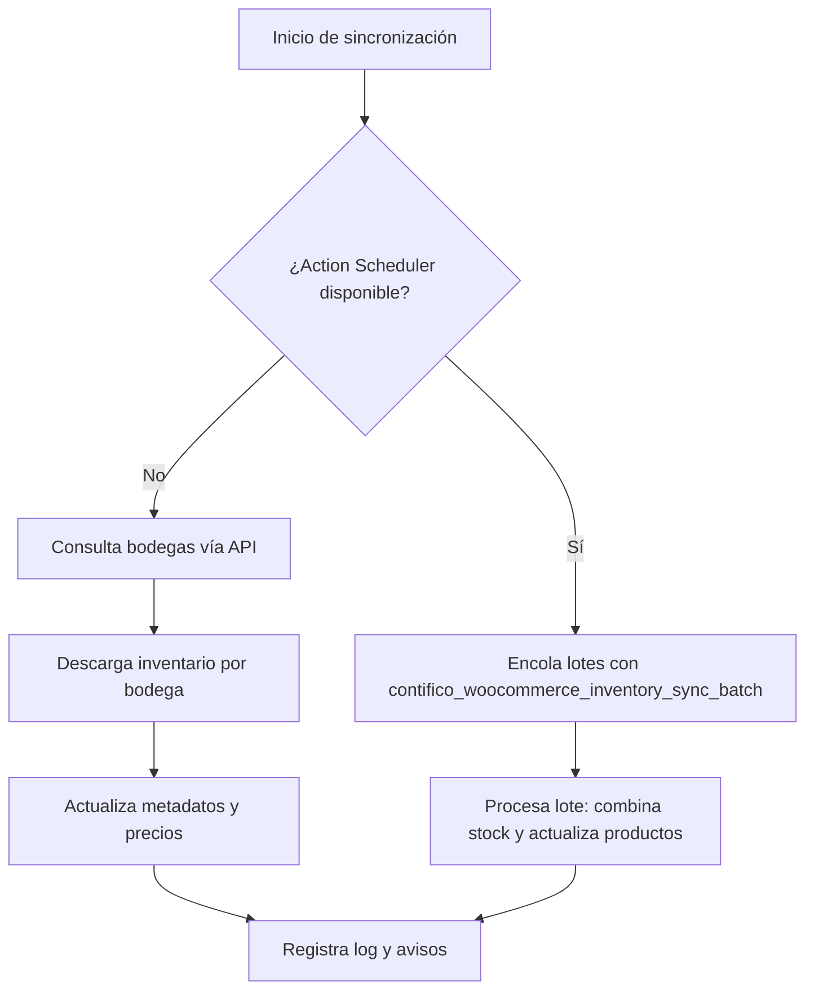

# Contifico WooCommerce

Integración completa entre WooCommerce y Contifico para sincronizar inventario, automatizar transferencias entre bodegas y emitir documentos electrónicos sin salir de WordPress.

## Tabla de contenido
1. [Descripción general](#descripción-general)
2. [Requisitos y compatibilidad](#requisitos-y-compatibilidad)
3. [Características principales](#características-principales)
4. [Arquitectura de componentes](#arquitectura-de-componentes)
5. [Configuración desde el panel de administración](#configuración-desde-el-panel-de-administración)
6. [Sincronización de inventario](#sincronización-de-inventario)
7. [Transferencias automáticas entre bodegas](#transferencias-automáticas-entre-bodegas)
8. [Facturación electrónica](#facturación-electrónica)
9. [Campos tributarios y experiencia de compra](#campos-tributarios-y-experiencia-de-compra)
10. [Cliente HTTP de Contifico](#cliente-http-de-contifico)
11. [Puntos de extensión (hooks y filtros)](#puntos-de-extensión-hooks-y-filtros)
12. [Recetas y ejemplos prácticos](#recetas-y-ejemplos-prácticos)
13. [Diagramas de flujo](#diagramas-de-flujo)
14. [Desarrollo y pruebas](#desarrollo-y-pruebas)
15. [Distribución](#distribución)

## Descripción general
El plugin añade un submenú dentro de WooCommerce para configurar credenciales, sincronizar inventario y definir parámetros de facturación electrónica. Durante el checkout captura los datos tributarios ecuatorianos, mantiene sincronizados los saldos por bodega y genera documentos en Contifico cuando el pedido alcanza el estado configurado. También permite reservar y devolver stock automáticamente entre bodegas físicas y la bodega web para evitar desajustes en Contifico.

## Requisitos y compatibilidad
- Sitio con WordPress y WooCommerce activos; el plugin se desactiva automáticamente si WooCommerce no está disponible y muestra un aviso en el escritorio administrativo.【F:wp-content/plugins/contifico-woocommerce/includes/class-plugin.php†L85-L121】【F:wp-content/plugins/contifico-woocommerce/includes/class-plugin.php†L148-L188】
- Acceso a la API de Contifico (URL base, API Key y API Secret) para consumir los servicios web protegidos.【F:wp-content/plugins/contifico-woocommerce/admin/class-settings.php†L66-L143】
- Permisos de usuario con capacidad `manage_woocommerce` para administrar la configuración, ejecutar sincronizaciones manuales y descargar registros.【F:wp-content/plugins/contifico-woocommerce/admin/class-settings.php†L34-L44】【F:wp-content/plugins/contifico-woocommerce/includes/sync/class-inventory-sync.php†L247-L277】

## Características principales
- **Sincronización automática de inventario:** programa un cron interno, consulta bodegas y existencias, actualiza metadatos por producto y registra bitácoras detalladas. Cuando Action Scheduler está disponible procesa la información en lotes para evitar tiempos de espera prolongados.【F:wp-content/plugins/contifico-woocommerce/includes/sync/class-inventory-sync.php†L120-L217】【F:wp-content/plugins/contifico-woocommerce/includes/sync/class-inventory-sync.php†L356-L608】
- **Actualización opcional de precios:** durante la sincronización puede propagar a WooCommerce la lista de precios PVP seleccionada (PVP1, PVP2, PVP3) o ignorar cambios si se escoge "No actualizar precios".【F:wp-content/plugins/contifico-woocommerce/admin/class-settings.php†L186-L205】【F:wp-content/plugins/contifico-woocommerce/includes/sync/class-inventory-sync.php†L1088-L1155】
- **Transferencias automáticas entre bodegas:** al cambiar el estado de un pedido el plugin puede reservar unidades desde la bodega física hacia la bodega web y revertirlas si el pedido se cancela o reembolsa.【F:wp-content/plugins/contifico-woocommerce/includes/class-inventory-transfer-manager.php†L15-L126】
- **Facturación electrónica integrada:** genera documentos en Contifico cuando el pedido alcanza el estado configurado o desde una acción manual, evitando duplicados y actualizando la numeración secuencial para facturas.【F:wp-content/plugins/contifico-woocommerce/includes/class-invoice-manager.php†L17-L161】
- **Panel de diagnóstico:** antes del formulario de ajustes se muestra un resumen del estado de cada bloque de configuración con enlaces directos para completar los datos faltantes.【F:wp-content/plugins/contifico-woocommerce/admin/class-settings.php†L1173-L1351】
- **Registro descargable de API:** permite activar un log detallado de solicitudes y descargar el archivo desde la página de ajustes cuando se necesite depuración.【F:wp-content/plugins/contifico-woocommerce/admin/class-settings.php†L119-L184】【F:wp-content/plugins/contifico-woocommerce/includes/api/class-contifico-client.php†L888-L977】
- **Checkout enriquecido con datos fiscales:** añade campos de tipo de contribuyente, identificación, razón social y preferencias de facturación tanto en el proceso de compra como en la página de cuenta.【F:wp-content/plugins/contifico-woocommerce/public/class-public.php†L33-L102】【F:wp-content/plugins/contifico-woocommerce/public/class-public.php†L206-L331】

## Arquitectura de componentes
| Módulo | Clase principal | Responsabilidades |
| ------ | --------------- | ----------------- |
| Núcleo | `Contifico_WooCommerce_Plugin` | Carga el autoloader, inicializa módulos administrativos/públicos/sync, prepara el cliente de API y registra hooks globales, incluidas las rutinas de activación/desactivación y el re-agendamiento del cron al cambiar ajustes.【F:wp-content/plugins/contifico-woocommerce/includes/class-plugin.php†L15-L214】 |
| Administración | `Contifico_WooCommerce_Admin` + `Contifico_WooCommerce_Admin_Settings` | Renderiza la página de ajustes, sanea datos, muestra herramientas de inventario, crea el panel de diagnóstico, gestiona acciones manuales de pedidos y avisos cuando faltan credenciales.【F:wp-content/plugins/contifico-woocommerce/admin/class-settings.php†L16-L566】【F:wp-content/plugins/contifico-woocommerce/admin/class-settings.php†L1119-L1289】【F:wp-content/plugins/contifico-woocommerce/admin/class-admin.php†L16-L90】 |
| Parte pública | `Contifico_WooCommerce_Public` | Marca pedidos para sincronización, expone el stock por bodega en la tienda, valida los campos tributarios y dispara la acción `contifico_woocommerce_queue_order` en la página de agradecimiento.【F:wp-content/plugins/contifico-woocommerce/public/class-public.php†L15-L205】 |
| Sincronización de inventario | `Contifico_WooCommerce_Sync_Inventory_Sync` | Gestiona cron, REST API, Action Scheduler, cache transitoria, limpieza de metadatos y registro de bitácoras con totales y errores.【F:wp-content/plugins/contifico-woocommerce/includes/sync/class-inventory-sync.php†L15-L1012】【F:wp-content/plugins/contifico-woocommerce/includes/sync/class-inventory-sync.php†L1800-L2071】 |
| Transferencias de stock | `Contifico_WooCommerce_Inventory_Transfer_Manager` | Detecta cambios de estado, construye los movimientos de inventario y conserva el estado en metadatos para revertirlos cuando corresponda.【F:wp-content/plugins/contifico-woocommerce/includes/class-inventory-transfer-manager.php†L15-L259】 |
| Facturación | `Contifico_WooCommerce_Invoice_Manager` + `Contifico_WooCommerce_Tax_Helper` | Construye el payload del documento con impuestos, descuentos, línea de envío y datos del cliente; valida cédula/RUC, prioriza campos en checkout y guarda metadatos del documento generado.【F:wp-content/plugins/contifico-woocommerce/includes/class-invoice-manager.php†L17-L494】【F:wp-content/plugins/contifico-woocommerce/includes/class-tax-helper.php†L15-L330】 |
| Cliente HTTP | `Contifico_WooCommerce_Api_Contifico_Client` | Encapsula solicitudes autenticadas, maneja reintentos, valida payloads y expone utilidades para logging y rutas base configurables.【F:wp-content/plugins/contifico-woocommerce/includes/api/class-contifico-client.php†L15-L977】 |

## Configuración desde el panel de administración
El submenú **WooCommerce → Contifico** agrupa los ajustes en bloques temáticos. Cada campo se valida con `sanitize_text_field`, `esc_url_raw` o métodos específicos antes de guardarse.【F:wp-content/plugins/contifico-woocommerce/admin/class-settings.php†L187-L453】【F:wp-content/plugins/contifico-woocommerce/admin/class-settings.php†L552-L645】

### Credenciales de la API
| Campo | Descripción |
| ----- | ----------- |
| URL de la API | Dirección base del servicio REST (por defecto `https://api.contifico.com/sistema/api/v1`).【F:wp-content/plugins/contifico-woocommerce/admin/class-settings.php†L78-L107】 |
| API Key / API Secret | Credenciales firmadas para autenticar cada solicitud.【F:wp-content/plugins/contifico-woocommerce/admin/class-settings.php†L93-L143】 |
| Registro de solicitudes | Activa/desactiva el log y permite descargar el archivo generado por `WC_Log_Handler_File`. Útil en escenarios de soporte.【F:wp-content/plugins/contifico-woocommerce/admin/class-settings.php†L119-L184】 |
| Bodega o punto de emisión | Identificador en Contifico donde se registrarán ventas y ajustes de stock.【F:wp-content/plugins/contifico-woocommerce/admin/class-settings.php†L131-L143】 |

### Parámetros de sincronización
| Campo | Descripción |
| ----- | ----------- |
| Estados a sincronizar | Lista de estados de pedido que se enviarán a Contifico cuando se procese la cola externa.【F:wp-content/plugins/contifico-woocommerce/admin/class-settings.php†L145-L185】 |
| Frecuencia automática | Permite elegir entre ejecución manual, cada 15 minutos, cada hora, dos veces al día o diaria. La opción "Manual" limpia el cron programado.【F:wp-content/plugins/contifico-woocommerce/admin/class-settings.php†L160-L205】【F:wp-content/plugins/contifico-woocommerce/includes/sync/class-inventory-sync.php†L140-L175】 |
| Tamaño del lote | Número de productos por trabajo en Action Scheduler (mínimo 10).【F:wp-content/plugins/contifico-woocommerce/admin/class-settings.php†L174-L185】【F:wp-content/plugins/contifico-woocommerce/includes/sync/class-inventory-sync.php†L1870-L1884】 |
| Lista de precios | Selecciona qué PVP actualiza el `regular_price` en WooCommerce o desactiva la propagación.【F:wp-content/plugins/contifico-woocommerce/admin/class-settings.php†L186-L205】 |

### Herramientas de inventario
- Botón para lanzar la sincronización inmediata vía `admin-post.php?action=contifico_inventory_sync` con verificación `nonce`.
- Panel con la bitácora del último proceso (contexto, bodegas procesadas, productos actualizados e incidencias).【F:wp-content/plugins/contifico-woocommerce/admin/class-settings.php†L1119-L1206】

### Movimientos entre bodegas
Permite definir si se activan las transferencias automáticas, la bodega origen/destino y los estados que desencadenan reservas o devoluciones.【F:wp-content/plugins/contifico-woocommerce/admin/class-settings.php†L221-L316】

### Facturación electrónica
Incluye campos para habilitar la emisión automática, escoger el estado disparador, tipo de documento (FAC, PRE, COT), ambiente (pruebas/producción), tokens de punto de venta, establecimiento, punto de emisión, numeración siguiente, datos del emisor y SKU del producto de envío.【F:wp-content/plugins/contifico-woocommerce/admin/class-settings.php†L292-L566】

## Sincronización de inventario
1. **Programación automática:** al iniciar registra un cron basado en el intervalo seleccionado; si la frecuencia es "Manual" limpia cualquier evento pendiente.【F:wp-content/plugins/contifico-woocommerce/includes/sync/class-inventory-sync.php†L134-L175】
2. **Ejecución manual:** disponible desde el panel de ajustes, vía endpoint REST o al llamar `Contifico_WooCommerce_Sync_Inventory_Sync::sync_inventory()` programáticamente. El método devuelve un arreglo con mensaje y resumen o un `WP_Error` con el motivo del fallo.【F:wp-content/plugins/contifico-woocommerce/includes/sync/class-inventory-sync.php†L247-L331】【F:wp-content/plugins/contifico-woocommerce/includes/sync/class-inventory-sync.php†L278-L310】
3. **Procesamiento por lotes:** cuando detecta Action Scheduler encola trabajos con el hook `contifico_woocommerce_inventory_sync_batch`, persistiendo el estado en `contifico_woocommerce_inventory_batch_state` hasta finalizar.【F:wp-content/plugins/contifico-woocommerce/includes/sync/class-inventory-sync.php†L214-L235】【F:wp-content/plugins/contifico-woocommerce/includes/sync/class-inventory-sync.php†L608-L891】
4. **Actualización de productos:** agrupa el inventario por bodega, limpia metadatos obsoletos (`_contifico_stock_by_warehouse`), guarda los saldos normalizados y sincroniza el precio según la lista seleccionada. También almacena el identificador remoto del producto cuando está disponible.【F:wp-content/plugins/contifico-woocommerce/includes/sync/class-inventory-sync.php†L872-L1107】
5. **Logs y avisos:** conserva el último resultado en la opción `contifico_woocommerce_inventory_log`, muestra un aviso temporal por usuario y permite descargar el detalle desde el panel de ajustes.【F:wp-content/plugins/contifico-woocommerce/includes/sync/class-inventory-sync.php†L1012-L1076】【F:wp-content/plugins/contifico-woocommerce/admin/class-settings.php†L1119-L1206】
6. **Filtros de personalización:** expone filtros para ajustar TTL del caché de stock (`contifico_woocommerce_inventory_stock_cache_ttl`), intervalo cron (`contifico_woocommerce_inventory_sync_interval`) y tamaño del lote (`contifico_woocommerce_inventory_batch_size`).【F:wp-content/plugins/contifico-woocommerce/includes/sync/class-inventory-sync.php†L706-L1884】

## Transferencias automáticas entre bodegas
- Escucha `woocommerce_order_status_changed` y normaliza los estados para compararlos con la configuración.
- Al reservar stock construye un movimiento con origen, destino, referencia del pedido y líneas por ítem (SKU, cantidad, precio), registrando el resultado en `_contifico_inventory_transfer_state` y dejando una nota en el pedido.【F:wp-content/plugins/contifico-woocommerce/includes/class-inventory-transfer-manager.php†L58-L166】
- Al revertir un pedido reutiliza la misma información para devolver las unidades a la bodega original y marca el movimiento como resuelto.【F:wp-content/plugins/contifico-woocommerce/includes/class-inventory-transfer-manager.php†L168-L259】
- Utiliza `Contifico_WooCommerce_Api_Contifico_Client::create_inventory_transfer()` para emitir el movimiento y reporta errores mediante notas y el logger configurable.【F:wp-content/plugins/contifico-woocommerce/includes/api/class-contifico-client.php†L256-L343】【F:wp-content/plugins/contifico-woocommerce/includes/class-inventory-transfer-manager.php†L99-L152】

## Facturación electrónica
- Agrega una acción manual "Generar documento en Contifico" en la pantalla de pedidos y registra un disparador automático según el estado configurado.【F:wp-content/plugins/contifico-woocommerce/includes/class-invoice-manager.php†L49-L92】
- Construye el payload con datos del cliente (nombre, identificación, correo, tipo de contribuyente), líneas de productos con impuestos/retenciones, descuentos, línea de envío y formas de pago. También maneja clientes extranjeros y múltiples tasas de IVA.【F:wp-content/plugins/contifico-woocommerce/includes/class-invoice-manager.php†L163-L441】
- Evita duplicados verificando los metadatos `_contifico_invoice_id` y `_contifico_invoice_number`, añade notas con el resultado y avanza la numeración secuencial cuando el documento es una factura (FAC).【F:wp-content/plugins/contifico-woocommerce/includes/class-invoice-manager.php†L49-L210】

## Campos tributarios y experiencia de compra
- `Contifico_WooCommerce_Public` añade campos para tipo de contribuyente, identificación, razón social, "¿Requiere factura a nombre de empresa?" y correo alterno. Los campos se validan con la ayuda de `Contifico_WooCommerce_Tax_Helper`, que comprueba cédulas/RUC ecuatorianos y determina qué campos son obligatorios según el tipo de contribuyente.【F:wp-content/plugins/contifico-woocommerce/public/class-public.php†L206-L331】【F:wp-content/plugins/contifico-woocommerce/includes/class-tax-helper.php†L175-L330】
- Los datos se guardan tanto en el pedido como en el perfil del usuario para reutilizarlos en compras futuras.【F:wp-content/plugins/contifico-woocommerce/public/class-public.php†L279-L331】
- El listado y la ficha de producto muestran el stock agrupado por bodega, diferenciando entre "Local" y "En línea" según la bodega configurada como local.【F:wp-content/plugins/contifico-woocommerce/public/class-public.php†L103-L205】

## Cliente HTTP de Contifico
El cliente encapsula `wp_remote_request`, firma las peticiones con autenticación básica usando los ajustes guardados y aplica reintentos ante errores recuperables (408, 425, 429, 5xx). También normaliza respuestas, convierte errores en `WP_Error` y registra cada solicitud cuando el log está activo.【F:wp-content/plugins/contifico-woocommerce/includes/api/class-contifico-client.php†L95-L343】【F:wp-content/plugins/contifico-woocommerce/includes/api/class-contifico-client.php†L596-L977】

### Endpoints soportados
| Método | Endpoint | Método PHP | Uso principal |
| ------ | -------- | ---------- | ------------- |
| GET | `/producto/` | `get_items()` | Recupera catálogo de productos paginado para mapear SKU e identificadores.【F:wp-content/plugins/contifico-woocommerce/includes/api/class-contifico-client.php†L49-L86】 |
| GET | `/bodega/` | `get_warehouses()` | Obtiene bodegas configuradas en Contifico para sincronización de stock.【F:wp-content/plugins/contifico-woocommerce/includes/api/class-contifico-client.php†L87-L120】 |
| GET | `/inventario/stock/bodega/{id}/` | `get_inventory_by_warehouse()` | Descarga el stock de una bodega específica, validando que se envíe el ID.【F:wp-content/plugins/contifico-woocommerce/includes/api/class-contifico-client.php†L122-L173】 |
| POST | `/documento/` | `create_invoice()` | Emite documentos electrónicos (facturas, prefacturas, cotizaciones).【F:wp-content/plugins/contifico-woocommerce/includes/api/class-contifico-client.php†L135-L170】 |
| POST | `/movimiento-inventario/` | `create_inventory_transfer()` | Registra movimientos AJU entre bodegas para reservas o devoluciones.【F:wp-content/plugins/contifico-woocommerce/includes/api/class-contifico-client.php†L256-L343】 |

### Utilidades destacadas
- `update_stock( $item_id, $payload )`: genera internamente un movimiento tipo `AJU` para ajustar existencias de un artículo específico.【F:wp-content/plugins/contifico-woocommerce/includes/api/class-contifico-client.php†L175-L255】
- `get_log_file_path()`: expone la ruta del archivo de log (`wp-content/uploads/wc-logs/contifico-woocommerce-*.log`) para permitir su descarga desde el panel.【F:wp-content/plugins/contifico-woocommerce/includes/api/class-contifico-client.php†L965-L973】
- `prepare_settings( $settings )`: normaliza credenciales externas e inyectadas, útil en pruebas unitarias y al iniciar el cliente desde otros contextos.【F:wp-content/plugins/contifico-woocommerce/includes/api/class-contifico-client.php†L345-L470】

## Puntos de extensión (hooks y filtros)
| Nombre | Tipo | Contexto | Descripción |
| ------ | ---- | -------- | ----------- |
| `contifico_woocommerce_manual_order_sync` | Acción | Administración | Se dispara al seleccionar "Sincronizar con Contifico" en la lista de pedidos; recibe el objeto `WC_Order` para integraciones personalizadas.【F:wp-content/plugins/contifico-woocommerce/admin/class-admin.php†L59-L83】 |
| `contifico_woocommerce_queue_order` | Acción | Público | Se ejecuta en la página de agradecimiento cuando un pedido quedó marcado para sincronización, entregando el ID del pedido listo para ser enviado a Contifico o a colas externas.【F:wp-content/plugins/contifico-woocommerce/public/class-public.php†L73-L102】 |
| `contifico_woocommerce_inventory_sync` | Acción programada | Sistema | Hook del cron interno que invoca la sincronización según el intervalo configurado.【F:wp-content/plugins/contifico-woocommerce/includes/sync/class-inventory-sync.php†L25-L173】 |
| `contifico_woocommerce_inventory_sync_batch` | Acción (Action Scheduler) | Sistema | Trabajo por lote que procesa fragmentos de inventario cuando hay soporte para colas asíncronas.【F:wp-content/plugins/contifico-woocommerce/includes/sync/class-inventory-sync.php†L30-L608】 |
| `contifico_woocommerce_account_fields` | Filtro | Público | Permite modificar los campos tributarios mostrados en el checkout y la cuenta antes de renderizarlos.【F:wp-content/plugins/contifico-woocommerce/includes/class-tax-helper.php†L175-L215】 |
| `contifico_woocommerce_inventory_stock_cache_ttl` | Filtro | Sincronización | Ajusta el tiempo de vida del caché transitorio que guarda inventario por bodega (por defecto 1 hora).【F:wp-content/plugins/contifico-woocommerce/includes/sync/class-inventory-sync.php†L706-L748】 |
| `contifico_woocommerce_inventory_sync_interval` | Filtro | Sincronización | Permite sobrescribir el intervalo programado antes de registrarlo en cron, útil para escenarios que requieren mayor frecuencia.【F:wp-content/plugins/contifico-woocommerce/includes/sync/class-inventory-sync.php†L1840-L1865】 |
| `contifico_woocommerce_inventory_batch_size` | Filtro | Sincronización | Cambia el tamaño del lote cuando se usa Action Scheduler (valor mínimo 10).【F:wp-content/plugins/contifico-woocommerce/includes/sync/class-inventory-sync.php†L1866-L1884】 |
| `contifico_woocommerce_log_value_length` | Filtro | API | Determina la longitud máxima de los valores que se escriben en el log antes de truncarlos (por defecto 2000 caracteres).【F:wp-content/plugins/contifico-woocommerce/includes/api/class-contifico-client.php†L888-L947】 |

## Recetas y ejemplos prácticos
### 1. Enviar pedidos a una cola externa
```php
add_action( 'contifico_woocommerce_queue_order', function ( $order_id ) {
    $payload = array(
        'order_id' => $order_id,
        'queued_at' => gmdate( 'c' ),
    );

    // Enviar a una cola personalizada o servicio externo.
    do_action( 'mi_plugin_enqueue_order', $payload );
} );
```

### 2. Ajustar la frecuencia del cron a 30 minutos
```php
add_filter( 'contifico_woocommerce_inventory_sync_interval', function ( $interval ) {
    if ( 'manual' === $interval ) {
        return $interval;
    }

    // Registramos un intervalo personalizado y devolvemos su identificador.
    add_filter( 'cron_schedules', function ( $schedules ) {
        $schedules['cada_30_min'] = array(
            'interval' => 30 * MINUTE_IN_SECONDS,
            'display'  => __( 'Cada 30 minutos', 'mi-plugin' ),
        );
        return $schedules;
    } );

    return 'cada_30_min';
} );
```

### 3. Mostrar el inventario sincronizado en una plantilla personalizada
```php
$product_id = 123; // ID de producto en WooCommerce.
$meta_key   = Contifico_WooCommerce_Sync_Inventory_Sync::get_meta_key();
$inventory  = get_post_meta( $product_id, $meta_key, true );

if ( ! empty( $inventory ) ) {
    foreach ( $inventory as $warehouse_id => $data ) {
        printf( '%s: %d unidades', $data['name'], (int) $data['stock'] );
    }
}
```

### 4. Ejecutar la sincronización vía REST
```bash
curl -X POST https://tu-sitio.com/wp-json/contifico-woocommerce/v1/inventory/sync \
  -H "Content-Type: application/json" \
  -H "X-WP-Nonce: <nonce-de-usuario-con-manage_woocommerce>"
```
El endpoint devuelve un JSON con `success`, `message` y un resumen (`data`) que incluye bodegas procesadas, productos actualizados y contexto de ejecución.【F:wp-content/plugins/contifico-woocommerce/includes/sync/class-inventory-sync.php†L242-L331】

## Diagramas de flujo
### Flujo general de un pedido


### Sincronización de inventario


## Desarrollo y pruebas
### Dependencias de desarrollo
Instala las dependencias de Composer para contar con Brain\Monkey y stubs de WordPress al ejecutar las pruebas:
```bash
composer install
```

### Pruebas automatizadas
Ejecuta la suite de PHPUnit, que cubre el cliente HTTP, la sincronización de inventario, el gestor de transferencias y diversos stubs de WooCommerce:
```bash
composer test
```
Los stubs necesarios para `WC_Product`, `WC_Order` y `WC_Order_Item_Product` se encuentran dentro de `tests/stubs/`.

## Distribución
Asegúrate de tener habilitada la extensión `zip` de PHP y genera el paquete instalable con:
```bash
composer build-release
```
El archivo comprimido quedará disponible en `dist/contifico-woocommerce.zip` para subirlo desde **Plugins → Añadir nuevo → Subir plugin** en el administrador de WordPress.
